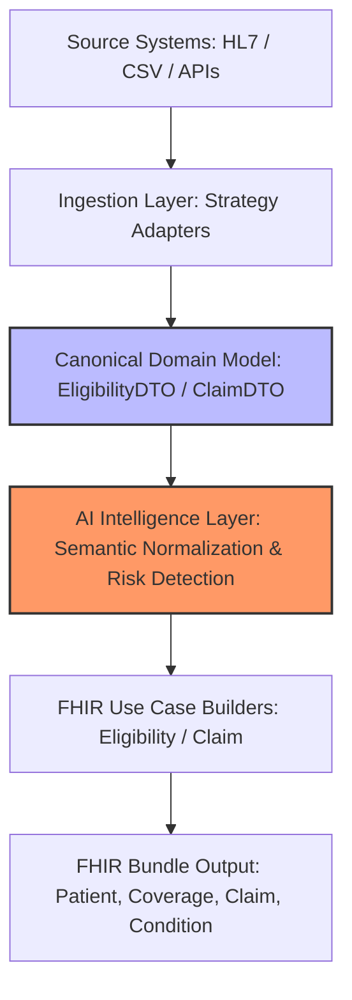
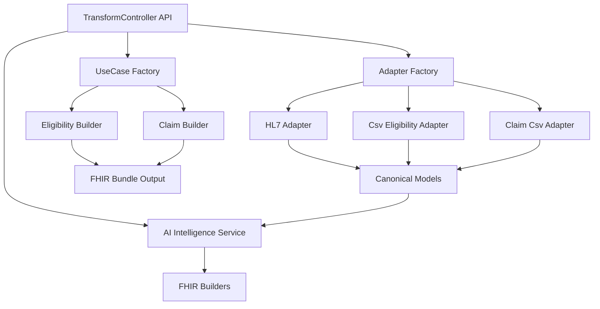
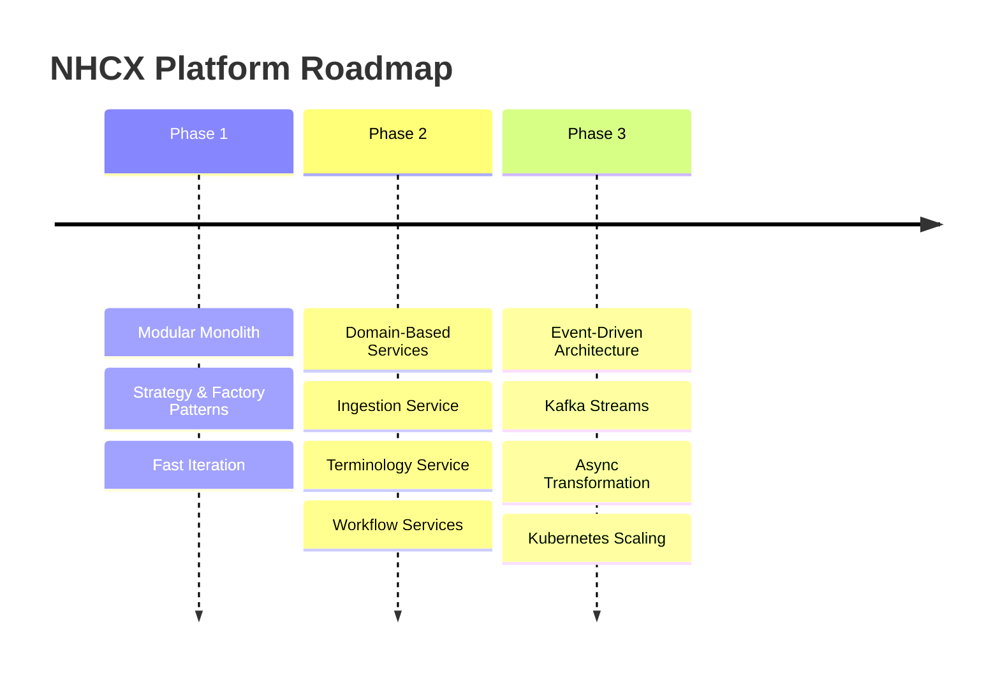

# NHCX Interoperability Platform

**AI-ready healthcare interoperability middleware that converts heterogeneous healthcare data (HL7, CSV, legacy systems) into standardized FHIR bundles across multiple workflows — Eligibility and Claims — without rewriting core logic.**

---

## 🚀 30-Second Pitch

Healthcare interoperability fails not because standards don’t exist, but because real hospital systems cannot easily speak those standards.

* Hospitals → **HL7 v2 messages**
* Insurers → **CSV / flat files**
* National Exchanges (NHCX/ABDM) → **FHIR APIs**

Every new connection becomes a custom integration project.

**We built a reusable adapter layer instead of another point-to-point integration.**

The platform:

* Accepts legacy healthcare data
* Normalizes it into a canonical healthcare model
* Enriches semantics using an AI layer
* Produces standards-compliant FHIR bundles

Instead of every hospital implementing FHIR, the platform **bridges existing systems into the national health ecosystem.**

## 🎥 Demo Video

[▶ Watch the 3-minute demo](https://drive.google.com/file/d/1alQ_ci_bq6ZpMYAP5DhYxITtExCgvW1B/view?usp=share_link)
---

## 🧠 Why This Is Different (Not Just a Converter)

Most projects:

> HL7 → FHIR mapping

Our approach:

> Source-agnostic ingestion → Canonical healthcare model → AI semantic enrichment → Multi-workflow FHIR transformation

Meaning:

* Add a new source → plug an adapter
* Add a new workflow → plug a builder
* No core rewrite

---

## Supported Workflows

**🟢 Coverage Eligibility — Implemented**
HL7 ingestion → Canonical normalization → AI enrichment → FHIR Patient & Coverage bundle

**🟢 Claims Processing — Implemented**
CSV ingestion → Canonical claim model → AI anomaly detection → FHIR Claim resource

**🟡 Prior Authorization — Architecture Ready**
Requires only a new DTO and FHIR builder

**🟡 Clinical Exchange — Architecture Ready**
Can generate Encounter, Observation, Condition resources

---

## Supported Inputs

* HL7 v2 ADT Messages
* CSV / Flat Files
* (Architected for APIs, Kafka streams, and DB exports)

---

## Standards Produced

* FHIR R4 Bundles
* SNOMED Clinical Coding
* Patient, Coverage, Claim, and Condition Resources

---

## 🏗️ Architecture Overview

Pipeline:

```
Source → Adapter → Canonical Model → AI Layer → FHIR Builder → FHIR Bundle
```


### Layer Responsibilities

**Ingestion Layer**

* Strategy Pattern
* Parses HL7/CSV without business assumptions

**Canonical Layer**

* Normalizes healthcare meaning
* Decouples format from semantics

**AI Intelligence Layer**

* Cleans messy real-world data
* Normalizes demographics
* Flags abnormal claims

**FHIR Builder Layer**

* Converts canonical meaning into FHIR resources
* Workflow-specific (Eligibility vs Claim)

---


    

## 🤖 Where AI Fits

AI operates **after normalization but before FHIR generation**.

It does NOT:

* parse HL7
* generate FHIR

It DOES:

* normalize demographics
* interpret free-text diagnoses
* detect suspicious claims

> AI enhances healthcare meaning, not replace standards.

---

## 🧩 Extensibility

Add a new source:

```
Create a new IngestionAdapter
```

Add a new workflow:

```
Create a new FhirUseCaseBuilder
```

Add real AI:

```
Replace MockAiIntelligenceService with NLP/LLM/Terminology service
```

No core logic changes required.

---

## ⚙️ Running the Project

### Prerequisites

* Java 17+
* Maven

### Start Application

```bash
mvn spring-boot:run
```

Open:

```
http://localhost:8080
```

---

## 🧪 Demo Scenarios

### 1) Eligibility (HL7)

Paste an HL7 ADT message.

Output:

* FHIR Patient
* FHIR Coverage
* FHIR Condition (SNOMED coded)

### 2) Claims (CSV)

Input:

```
CLM9999,12345,PROV001,HMO123,2024-03-01,E11.9,99213,25000.00
```

Output:

* FHIR Claim resource
* AI anomaly detection

---

## 📈 Scalability Vision

Current:

> Modular monolith for fast iteration

Future:

* Ingestion Service
* Terminology Service
* Eligibility Service
* Claims Service

Then:

> Event-driven architecture using messaging

Stateless design enables:

* Horizontal scaling
* Kubernetes autoscaling
* Load balancing

---



## 🎯 Why This Matters for NHCX / ABDM

A national health exchange cannot depend on:

* One vendor
* One message format
* One workflow

This platform acts as a **universal adapter layer** between legacy hospital systems and modern FHIR ecosystems, reducing onboarding effort for providers and insurers.

---

## Key Takeaway

We did not build a point solution.

We built a **foundation interoperability layer** that allows heterogeneous healthcare systems to participate in standardized digital health ecosystems — the missing middle layer in interoperability.
